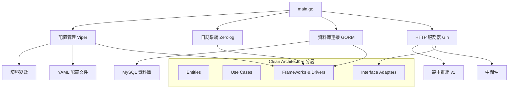
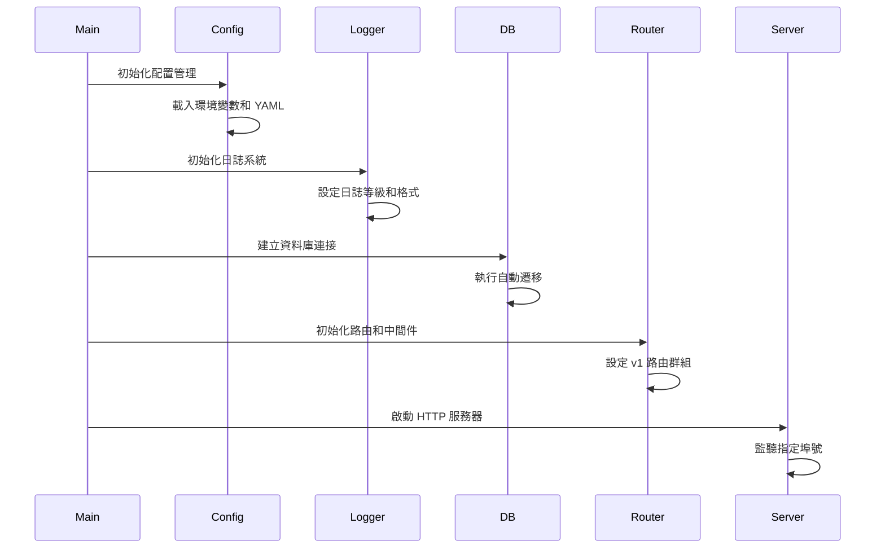
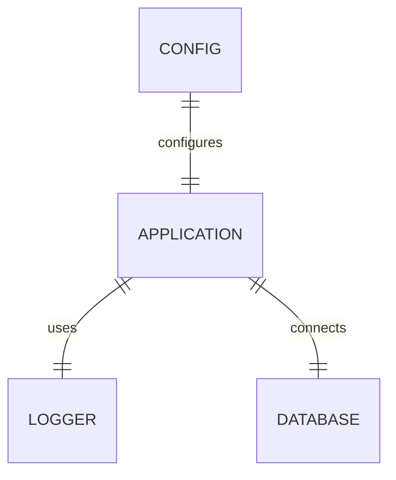

# 技術設計文件

## 概述
基於 Clean Architecture 和測試驅動開發 (TDD) 的 Go Todolist Service 專案初始化技術設計。此設計將建立完整的專案基礎架構，包含 main.go 入口點、配置管理系統、日誌系統、資料庫連接和 API 框架的整合。

## 需求對應

### 設計組件追蹤
每個設計組件對應特定需求：
- **專案結構建立** → REQ-1: 建立 main.go 入口點
- **配置管理系統** → REQ-2: 建立 config 設定 (環境變數 + YAML)
- **日誌系統** → REQ-3: 建立 log 初始化
- **資料庫層** → REQ-4: 建立 MySQL 連接
- **API 框架** → REQ-5: 建立 API 框架和路由設定

### 使用者故事涵蓋
- **開發人員需求**: 透過模組化結構和清晰的依賴管理提供良好的開發體驗
- **運維人員需求**: 透過配置管理和日誌系統提供可監控和可維護的系統
- **測試需求**: 透過 TDD 方法確保代碼品質和可測試性

## 架構設計

### 整體系統架構


### 技術棧
基於研究發現和需求分析：

- **程式語言**: Golang (高效能、併發處理)
- **Web 框架**: Gin (輕量級、高效能路由處理)
- **資料庫**: MySQL (可靠的 ACID 特性)
- **ORM**: GORM (自動遷移、關聯處理)
- **配置管理**: Viper (多格式支援、環境變數綁定)
- **日誌系統**: Zerolog (高效能結構化日誌)
- **測試框架**: Go Testing + Testify (標準測試 + 豐富斷言)
- **依賴管理**: Go Modules (官方依賴管理)

### 架構決策理由
基於技術研究的關鍵決策：

- **為什麼選擇 Gin**: 輕量級、高效能，適合 RESTful API，社群活躍，文件完整
- **為什麼選擇 GORM**: 功能豐富的 ORM，支援自動遷移，與 MySQL 整合良好
- **為什麼選擇 Viper**: 強大的配置管理能力，支援多種格式和環境變數自動綁定
- **為什麼選擇 Zerolog**: 高效能結構化日誌，適合生產環境，JSON 格式輸出

## 資料流程

### 應用程式啟動流程


## 組件和介面

### 核心服務與方法簽名
```go
// 配置管理服務
type ConfigService interface {
    LoadConfig() error
    GetDatabaseConfig() *DatabaseConfig
    GetServerConfig() *ServerConfig
    GetLogConfig() *LogConfig
}

// 資料庫服務
type DatabaseService interface {
    Connect() (*gorm.DB, error)
    Migrate() error
    Close() error
}

// 日誌服務
type LoggerService interface {
    InitLogger(config *LogConfig) (zerolog.Logger, error)
    GetLogger() zerolog.Logger
}

// HTTP 服務器服務
type ServerService interface {
    SetupRouter() *gin.Engine
    StartServer(router *gin.Engine, port string) error
}
```

### API 端點設計
| Method | Route | Purpose | Auth | Status Codes |
|--------|-------|---------|------|--------------|
| GET    | /health | 健康檢查 | None | 200, 500 |
| GET    | /version | 版本資訊 | None | 200 |

## 資料模型

### 領域實體
1. **Config**: 配置實體 (系統配置管理)
2. **Logger**: 日誌實體 (日誌管理)

### 實體關係


### 資料模型定義
```go
// 配置結構
type Config struct {
    Database DatabaseConfig `mapstructure:"database"`
    Server   ServerConfig   `mapstructure:"server"`
    Log      LogConfig      `mapstructure:"log"`
}

type DatabaseConfig struct {
    Host     string `mapstructure:"host"`
    Port     int    `mapstructure:"port"`
    Name     string `mapstructure:"name"`
    User     string `mapstructure:"user"`
    Password string `mapstructure:"password"`
}

type ServerConfig struct {
    Port string `mapstructure:"port"`
    Mode string `mapstructure:"mode"`
}

type LogConfig struct {
    Level  string `mapstructure:"level"`
    Format string `mapstructure:"format"`
    Output string `mapstructure:"output"`
}
```

### 資料庫架構
初始化階段僅建立資料庫連接和基本配置，具體的業務資料表將在後續的功能開發中定義。

### 遷移策略
- **自動遷移**: 使用 GORM 的 AutoMigrate 功能準備
- **向後相容性**: 保持資料表結構的向後相容
- **遷移管理**: 為未來的資料表遷移建立基礎架構

## 錯誤處理

### 錯誤處理策略
```go
// 自定義錯誤類型
type AppError struct {
    Code    int    `json:"code"`
    Message string `json:"message"`
    Details string `json:"details,omitempty"`
}

func (e *AppError) Error() string {
    return e.Message
}

// 錯誤處理中間件
func ErrorHandler() gin.HandlerFunc {
    return func(c *gin.Context) {
        c.Next()
        
        if len(c.Errors) > 0 {
            err := c.Errors.Last()
            
            switch e := err.Err.(type) {
            case *AppError:
                c.JSON(e.Code, e)
            default:
                c.JSON(500, gin.H{
                    "code":    500,
                    "message": "Internal server error",
                })
            }
        }
    }
}
```

## 安全性考量

### 配置安全
- **環境變數管理**: 敏感資訊透過環境變數管理
- **配置檔案安全**: 配置檔案不包含敏感資訊
- **預設值策略**: 提供安全的預設配置值

### 資料保護
- **輸入驗證**: 使用 Gin 的綁定和驗證功能
- **SQL 注入防護**: GORM 提供的 ORM 保護
- **資料加密**: 敏感資料在傳輸和儲存時的加密

### 安全最佳實踐
- **CORS 配置**: 設定適當的跨域存取規則
- **安全標頭**: 實作必要的 HTTP 安全標頭
- **速率限制**: 實作 API 速率限制機制

## 效能與擴展性

### 效能目標
| 指標 | 目標 | 測量方式 |
|------|------|----------|
| 啟動時間 | < 5 秒 | 應用程式完全啟動時間 |
| 回應時間 (p95) | < 200ms | API 端點回應時間 |
| 回應時間 (p99) | < 500ms | API 端點回應時間 |
| 記憶體使用 | < 100MB | 基礎運行記憶體 |
| 並發連線 | > 1000 | 同時處理的 HTTP 連線 |

### 快取策略
- **配置快取**: Viper 自動快取已載入的配置
- **連接池**: GORM 資料庫連接池管理
- **HTTP 快取**: 適當的 HTTP 快取標頭設定

### 擴展性方案
- **水平擴展**: 支援多實例部署
- **資料庫擴展**: 讀寫分離和連接池配置
- **非同步處理**: 為未來的背景工作做準備
- **監控整合**: 日誌和指標收集準備

## 測試策略

### 測試涵蓋率需求
- **單元測試**: ≥80% 代碼涵蓋率
- **整合測試**: 配置管理、日誌系統和資料庫連接整合
- **端到端測試**: 應用程式啟動和基礎設施流程
- **效能測試**: 啟動時間和基礎效能測試

### 測試方法

1. **單元測試**
   - 測試個別函數和方法
   - 模擬外部依賴
   - 專注於業務邏輯

2. **整合測試**
   - 資料庫連接測試
   - 配置載入測試
   - 日誌系統整合測試

3. **端到端測試**
   - 應用程式啟動流程
   - 健康檢查端點測試
   - 錯誤處理流程

4. **測試驅動開發 (TDD)**
   - 紅-綠-重構循環
   - 先寫測試，後寫實作
   - 持續重構改進

### CI/CD 流水線


### 測試工具和框架
- **Go Testing**: 標準測試框架
- **Testify**: 豐富的斷言和模擬工具
- **GoMock**: 介面模擬生成工具
- **Dockertest**: 整合測試中的資料庫容器管理
- **httptest**: HTTP 測試工具

## 專案結構實作

### 目錄結構規劃
```
go-todolist-service/
├── main.go                    # 應用程式入口點
├── go.mod                     # Go modules 依賴管理
├── go.sum                     # 依賴版本鎖定
├── .env                       # 環境變數配置
├── .gitignore                 # Git 忽略規則
├── README.md                  # 專案說明文件
├── CLAUDE.md                  # Claude 開發指引
├── cmd/                       # 應用程式命令行工具
│   └── todolist/             # todolist 服務命令
├── internal/                  # 私有應用程式代碼 (Clean Architecture)
│   ├── domain/               # 領域層 (Entities & Business Logic)
│   ├── delivery/             # 交付層 (Controllers & Handlers)
│   └── infrastructure/       # 基礎設施層 (External Dependencies)
│       └── config/           # 配置管理
└── .kiro/                    # Kiro 專案管理配置
    ├── specs/                # 規格說明文件
    │   └── {feature-name}/   # 專案功能文件
    └── steering/             # 專案引導文件
        ├── product.md
        ├── structure.md
        └── tech.md
```

## 實作里程碑

### 階段 1: 基礎架構 (Week 1)
1. 建立專案結構和 go.mod
2. 實作配置管理系統
3. 實作日誌系統
4. 建立基本測試框架

### 階段 2: 資料層 (Week 2)
1. 實作資料庫連接管理
2. 建立基礎資料庫配置和連接池
3. 實作資料庫整合測試

### 階段 3: API 層 (Week 3)
1. 實作 Gin HTTP 服務器
2. 建立路由群組和中間件
3. 實作健康檢查和版本端點
4. 完善錯誤處理機制

### 階段 4: 整合與測試 (Week 4)
1. 完成端到端測試
2. 效能測試和優化
3. 文件完善
4. 生產環境準備